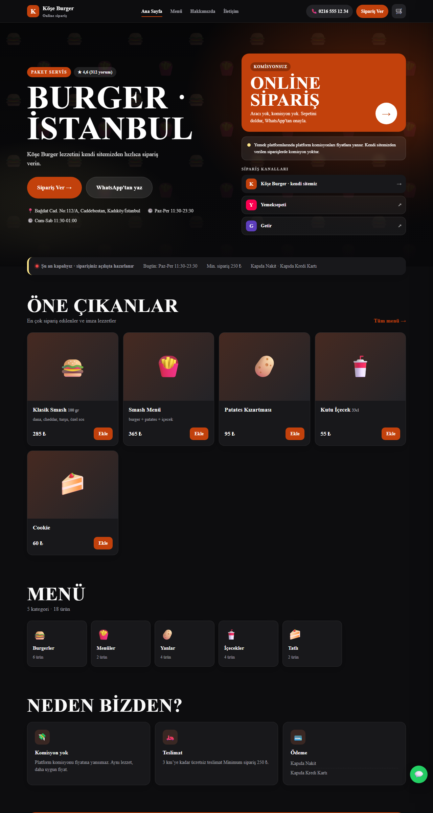
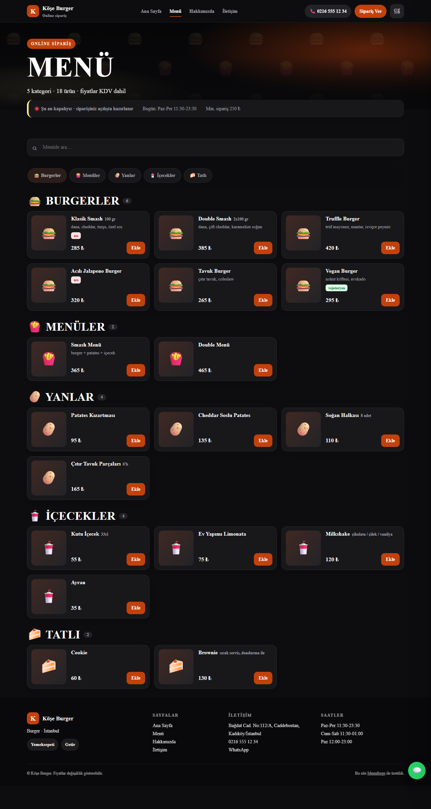

# Menuforge

**Foundry Local ile komisyonsuz sipariş sitesi üreteci.**

Esnaf ve küçük restoranlar için: Google Maps / Yemeksepeti profil metnini ve menüyü yapıştır,
yerel bir dil modeli (Microsoft **Foundry Local**) bunu yapılandırsın, birkaç saniyede
kendi **komisyonsuz sipariş siten** hazır olsun. Siparişler sepetten doğrudan **WhatsApp**'a düşer.
Ödeme entegrasyonu yok: kapıda nakit / kapıda kart.

> Microsoft Türkiye Yaz Programı 2026 — "kendi projem" teslimi.

## Neden

- Platform komisyonları %18-30 bandında. Restoranlar bunu fiyata yansıtıyor.
- Komisyonsuz sipariş sistemleri var, ama hepsi menüyü ve temayı **elle** girdiriyor. Esnaf bunu yapmıyor.
- Buradaki fark **sıfır kurulum**: mevcut profilden birkaç soruyla A'dan Z'ye site.
- Model yerel çalıştığı için müşteri adı/adres/telefon ve menü dükkânın bilgisayarından çıkmaz; API ücreti yok.

## Nasıl çalışır

```
profil + menü metni ──► Foundry Local (ministral 3B, yerel)
                            │  JSON çıkarımı · tema stili · slogan
                            ▼
                  doğrulama (Pydantic + onarım + kaynak kontrolü)
                            ▼
                       site.json ──► son kontrol tablosu (insan düzeltir)
                                            ▼
                             Jinja2 şablonları ──► out/<slug>/  (4 sayfa + css/js)
                                                        │
                                          sepet → WhatsApp hazır sipariş mesajı
```

Model sadece metni yapılandırır; HTML'i şablon üretir. Bu yüzden sitenin tasarım kalitesi modelden bağımsızdır.

## Üretilen site neler içerir

Dört sayfalık statik site, sunucu ve veritabanı gerektirmez, herhangi bir hosta atılır
(`index` · `menu` · `hakkimizda` · `iletisim` + `site.css` · `site.js` · `site.json`):
- **Ana sayfa:** tam ekran hero (kapak fotoğrafı ya da tasarımlı desen), büyük slogan, puan rozeti, kampanya kartı, komisyon notu, sipariş kanalları, öne çıkan ürünler, kategori kartları, "neden bizden", CTA
- **Menü:** açık/kapalı durumu (saatlerden hesaplanır), arama, yapışkan kategori çipleri, görselli ürün kartları, gramaj, eski/yeni fiyat, etiketler; kartta +/− adet
- **Sepet** (her sayfada): adrese teslim / gel-al, ödeme seçimi, not, teslimat ücreti → **WhatsApp'a hazır sipariş mesajı**; sepet sayfalar arasında korunur
- **Hakkımızda / İletişim:** hikâye, sayılar, saatler, Google Maps gömme, tüm kanallar tek listede
- SEO: meta, Open Graph, schema.org `Restaurant` + menü; mobil öncelikli; 4 tema (koyu, sıcak, taze, klasik)
- Fotoğraf: `hero.jpg` kapak; ürün adıyla eşleşen dosya adı otomatik bağlanır; eşleşmeyenler son adımda elle seçilir

**Son kontrol adımı:** model çıktısı tabloda düzenlenir (Türkçe karakter, gramaj, fiyat, eski fiyat, açıklama, etiket, görsel, satır silme/ekleme), slogan ve kapak seçilir, tek tıkla yeniden üretilir.

| Ana sayfa | Menü |
|---|---|
|  |  |

## Sistem gereksinimleri

| | En az | Geliştirildiği ve ölçüldüğü sistem |
|---|---|---|
| İşletim sistemi | Windows 10/11 (Foundry Local Windows ve macOS'ta çalışır; bu proje yalnızca Windows'ta denendi) | Windows 11 Pro 24H2 (build 26200) |
| Python | 3.10+ | 3.12.10 |
| Bellek | 8 GB RAM (3B model için) | 64 GB RAM |
| Ekran kartı | Gerekmez; model CPU'da da çalışır (CPU'da hız ölçülmedi) | NVIDIA GeForce RTX 5090, 32 GB, CUDA |
| Disk | ~5 GB (Foundry Local + 3B model + Python paketleri) | — |
| İnternet | Yalnızca ilk kurulumda (model ve paket indirme). Site üretimi tamamen çevrimdışı | — |
| Foundry Local | 0.10.x | 0.10.3 |

## İndirilenler

Kurulum sırasında bilgisayara inen her şey:

| Ne | Kaynak | Boyut | Zorunlu mu |
|---|---|---|---|
| Foundry Local | `winget install Microsoft.FoundryLocal` (Microsoft) | ~100 MB + ilk açılışta donanım sürücü bileşenleri (CUDA vb.) | Evet |
| `ministral-3-3b-instruct-2512` | Foundry Local model kataloğu | 3,6 GB | Evet (varsayılan model) |
| `mistral-7b-v0.2` | Foundry Local model kataloğu | 4,0 GB | Hayır (karşılaştırma) |
| Python paketleri | PyPI, `requirements.txt` | ~150 MB | Evet |

Python paketleri ve denenen sürümler:

| Paket | Sürüm | Ne için |
|---|---|---|
| `openai` | 3.20.0 | Foundry Local'ın yerel, OpenAI uyumlu uç noktasına bağlanmak (buluta istek gitmez) |
| `pydantic` | 2.13.5 | Model çıktısını şemaya göre doğrulamak |
| `jinja2` | 3.1.6 | Site şablonları |
| `streamlit` | 1.64.0 | Sihirbaz arayüzü |
| `pandas` | 3.0.6 | Son kontrol tablosu (streamlit ile gelir) |

Üretilen site ziyaretçinin tarayıcısında iki dış kaynak kullanır: Google Fonts (yazı tipi) ve Google Maps
gömmesi (iletişim sayfası). Ziyaretçi verisi toplanmaz; sipariş bilgisi yalnızca ziyaretçinin kendi
WhatsApp'ında hazır mesaj olarak açılır.

## Kurulum

```bash
winget install Microsoft.FoundryLocal
foundry model download ministral-3-3b-instruct-2512
pip install -r requirements.txt
```

Kontrol: `foundry cache list` modeli göstermeli.

## Kullanım

Sihirbaz arayüzü (önerilen):
```bash
streamlit run app/ui.py
```

Komut satırı:
```bash
python build.py examples/burger
python build.py examples/kasap --model mistral-7b-v0.2
```

Çıktı: `out/<slug>/` klasörü. İçindekileri herhangi bir statik hosta (Netlify Drop, Cloudflare Pages,
GitHub Pages, mevcut hosting'in `public_html` klasörü) yüklemek yeterli.

## Değerlendirme

```bash
python eval/run_eval.py --model ministral-3-3b-instruct-2512 --runs 3
python eval/run_eval.py --model mistral-7b-v0.2 --runs 3
```

| Model | Boyut | Ürün bulma | Fiyat isabeti | Süre / menü |
|---|---|---|---|---|
| ministral-3-3b (2025) | 3,6 GB | **1.00** | 0.97 | 5,1 sn |
| mistral-7b-v0.2 (2023) | 4,0 GB | 0.93 | 0.97 | 4,7 sn |

2 örnek menü × 3 çalıştırma, aynı prompt ve doğrulama katmanı. Küçük ama yeni model, iki kat büyük eski
modeli geçti: kaliteyi boyut değil, model nesli + istem/doğrulama disiplini belirledi.

Not: Bu kurulumda (Foundry 0.10.3, CUDA, RTX 5090) mistral-nemo-12b yinelenen alt-kelimeler üretti
("Ankara'dır'ır"), gemma-4-e2b-it ise hiç yüklenmedi (genai_config şema hatası). İkisi de karşılaştırma
dışı bırakıldı.

## Kapsam dışı (bilinçli)

Ödeme entegrasyonu, kullanıcı hesabı, çoklu şube, hosting, platformlardan otomatik kazıma.
Kazıma yerine kopyala-yapıştır tercih edildi: platform kullanım şartları ve bot koruması nedeniyle.

## Geliştirme notları

Aynı 3B modelde yalnızca istem ve doğrulama katmanı değiştirilerek kasap menüsünde ürün bulma oranı
0.15 → 0.80 → 1.00'e çıktı.

## Lisans

MIT
